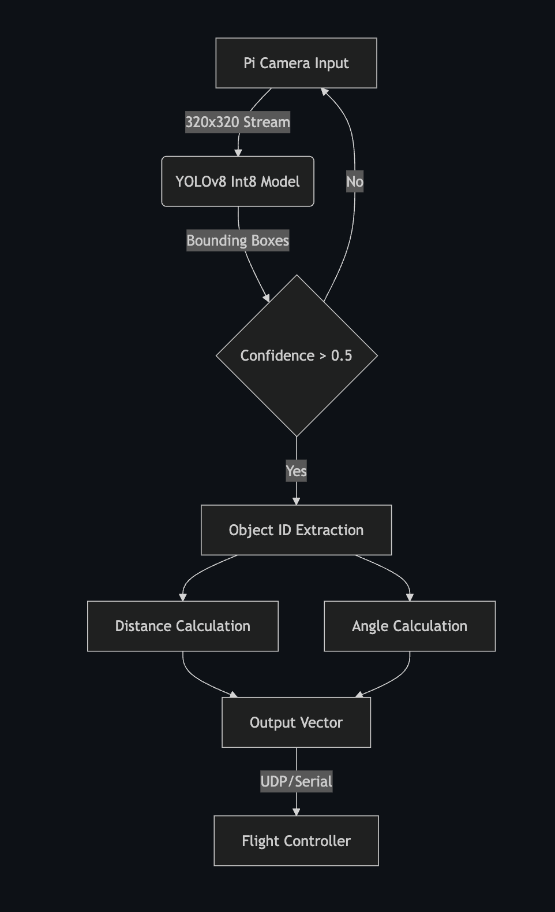
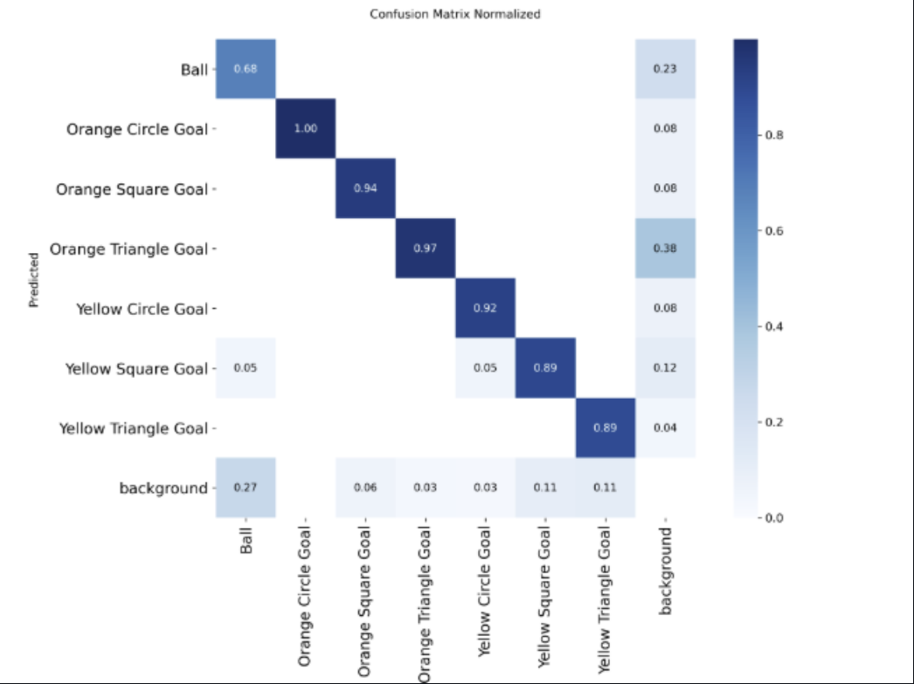
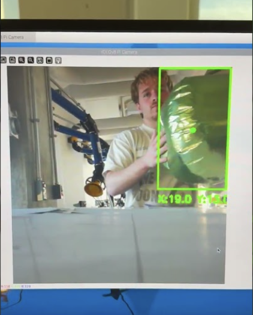

# Autonomous Aerial Robotics

## **Defend The Republic: Autonomous Aerial Computer Vision System**

## **Project Overview**

This repository contains the computer vision subsystem for the **Defend The Republic (DTR)** autonomous aerial competition team at Indiana University Bloomington.

As a Junior Intelligent Systems Engineering student, my role focused on developing a **low-latency object detection and range-finding pipeline**. The system enables an autonomous blimp/drone to identify game pieces (balloons and goals), calculate their precise 3D position relative to the vehicle, and feed navigation data to the flight controller in real time.

---

## **Key Capabilities**

- **Object Detection:** Identifies 8 distinct classes (Orange/Yellow Circles, Squares, Triangles; Purple/Green Balls) using a custom-trained YOLOv8 model.
- **Edge Optimization:** Optimized for Raspberry Pi 4, achieving **180ms inference time** (down from 1s) via quantization and input scaling.
- **3D Localization:** Algorithms compute distance (meters) and angles ($\theta_x, \theta_y$) from 2D bounding boxes.

---

## **System Architecture**

The pipeline processes video input to output navigation vectors for the flight controller.

---

## **Tech Stack**

**Hardware:** Raspberry Pi 4 Model B, Pi Camera Module  
**ML Frameworks:** PyTorch, Ultralytics YOLOv8  
**Data Processing:** Roboflow, OpenCV  
**Techniques:** INT8 Quantization, Transfer Learning, Trigonometric Range Finding

---

## **Engineering Challenges & Optimizations**

One of the significant challenges we faced was the hardware limitation of the **Raspberry Pi 4**.

### **1. Latency Reduction**

**Initial State:** The standard YOLOv8 model (`640×640`, float16) resulted in a **1-second inference time**, which was too slow for autonomous flight.

**Solution:** Two-step optimization:
- **Input Scaling:** Reduced input resolution to `320×320`.
- **Quantization:** Converted model weights from Float16 → Int8.

**Result:** Inference time dropped to **180 ms (~5.5 FPS)** while maintaining a high confidence threshold (`>0.73`) on game objects.

### **2. Distance Accuracy**

We implemented a custom script to calculate focal length based on **real-world physical measurements** rather than theoretical camera specs. This significantly reduced distance estimation error and allowed the drone to accurately gauge approach velocity.

---

## **Performance Metrics**

Below is a comparison of our optimization steps. We successfully reduced inference time by over 80% while maintaining detection precision.

---

## **Results & Accuracy**

### **Confusion Matrix**
Our model performance across all 8 classes on the test set:

---

## **Project Gallery & Visuals**

Here are demonstrations of the live object detection system running on the Raspberry Pi 4.

### **Live Inference Views**
The system displays confidence scores and real-time inference speed (approx 180ms).

### **Demos (Click to watch)**

| **Autonomous Flight Test** | **Angle & Distance Calculation** |
|:---:|:---:|
|  |  |
| *Full flight integration test* | *FOV 40° with coordinate output* |

---

## **Contact**

**Yoav K.** Junior, Intelligent Systems Engineering @ IU Bloomington

**LinkedIn:** [Your LinkedIn URL]
**Email:** ykrieger@iu.edu